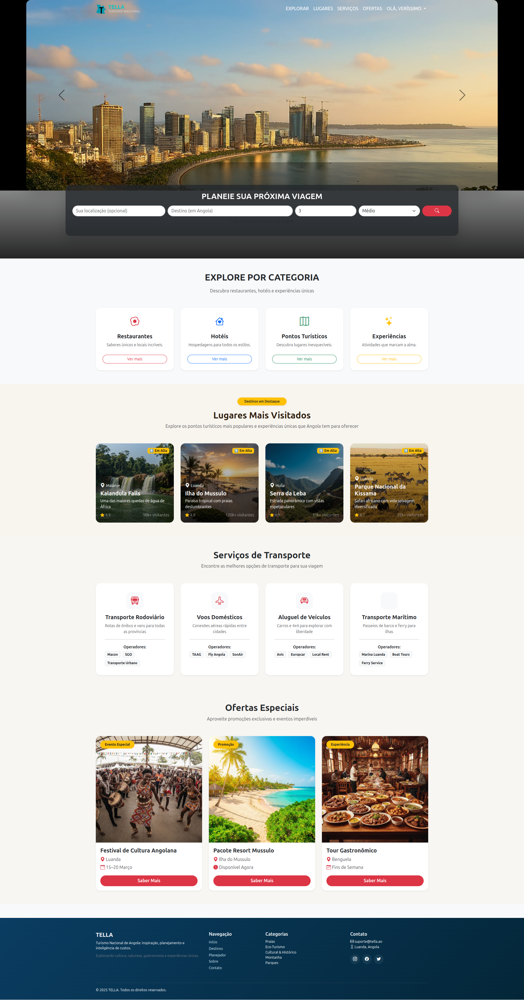
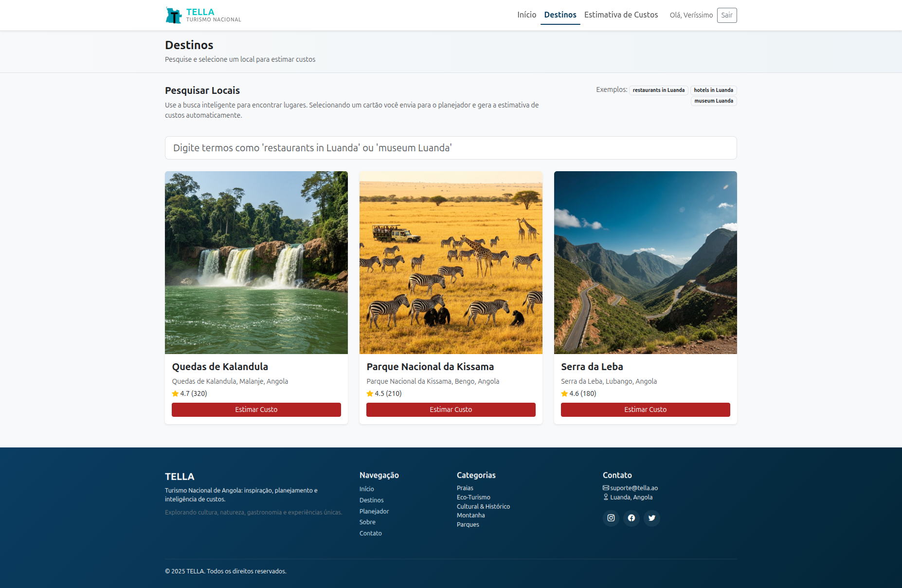
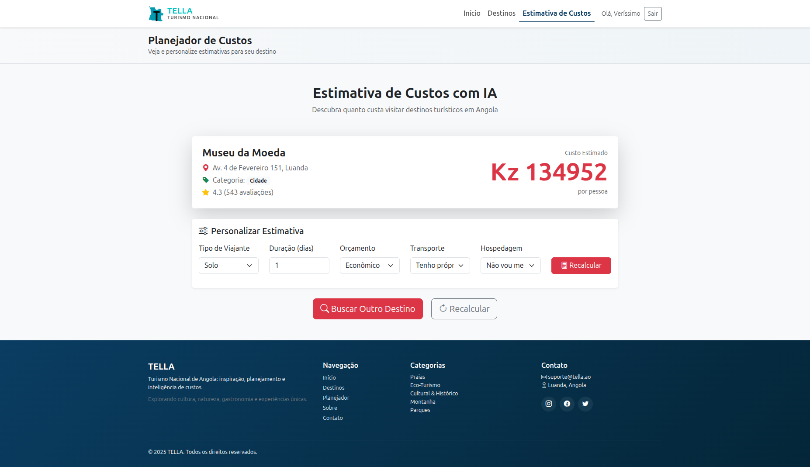

# Bootcamp de Machine Learning Angola — Frontier Tech Leaders

## FTL_Grupo09 - Capstone Project (Projecto Final)

Este repositório contém o projecto capstone do Grupo 09 para o Bootcamp de Machine Learning Angola — Frontier Tech Leaders.

## 📋 Sobre o Projecto

Este é o projecto final (capstone) que representa a culminação dos conhecimentos adquiridos durante o bootcamp. O projecto está organizado em entregas semanais, cada uma com objectivos específicos e marcos importantes.

## 📁 Estrutura do Repositório

O projecto está organizado por datas de entrega:

### 🗓️ Cronograma de Entregas

- **`2025-10-20/`** — **📅 Data de entrega: 20 de outubro de 2025**
  - Proposta de ideia
  - Revisão de literatura
  - Descrição dos dados
  - Definição das tecnologias

- **`2025-10-24/`** — **📅 Data de entrega: 24 de outubro de 2025**
  - Preparação de dados / Engenharia de recursos
  - Nota conceitual
  - Plano de implementação do projecto

- **`2025-10-31/`** - **📅 Data de entrega: 31 de outubro de 2025**
  - Documentação do projecto de Aprendizado de Máquina
  - Documentação da implantação

- **`2025-11-05/`** - **📅 Data de entrega: 5 de novembro de 2025**
  - Slides de apresentação
  - Documentação final completa

- **Apresentação Final** - **📅 Datas: 13 e 14 de novembro de 2025**
  - Apresentação oral do projecto
  - Defesa do trabalho desenvolvido

## 🎯 Objectivos

- Aplicar os conhecimentos adquiridos durante o bootcamp
- Desenvolver uma solução completa para um problema real
- Demonstrar competências técnicas e analíticas
- Apresentar resultados de forma clara e profissional

## 👥 Equipe

**Grupo 09**
- Felix Chivela
- João Baptista Diassiwa
- Nelson Domingos Eduardo
- José Mankela Zoka
- Jandiro Tanque
- Veríssimo Elias Cassange
- José Tabula Afonso

## 📚 Documentação

Cada pasta de entrega contém:
- `docs/` - Documentação específica da entrega
- `data/` - Dados utilizados no projecto
- `notebooks/` - Jupyter notebooks com análises
- `deliverables/` - Artefatos finais da entrega

## 🚀 Como Utilizar

1. Navegue até a pasta da entrega desejada
2. Consulte o README específico de cada entrega
3. Execute os notebooks na ordem indicada
4. Verifique os deliverables produzidos

## 🌐 Aplicação Deploy (MVP)
- URL: https://ftl-grupo09-1.onrender.com/
- Stack: Django + Modelo ML (joblib) + RapidAPI Places.

## 🖼️ Capturas (Demo)
| Home | Busca Destinos | Planejador |
|------|----------------|------------|
|  |  |  |

## 📞 Contato

Para dúvidas ou esclarecimentos sobre o projecto, entre em contato com a equipe do Grupo 09.

---

*Projeto desenvolvido como parte do Bootcamp de Machine Learning Angola – Frontier Tech Leaders*